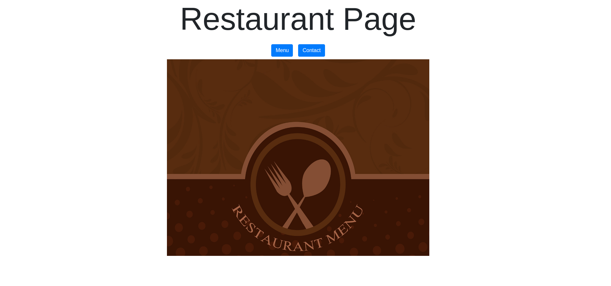

# Restaurant Page

### This is a simple restaurant webpage where you can toogle between the menu and contact. It was created to showcase the use of webpack and modular programming.

### Built with
- JavaScript Vanilla
- HTML5 
- CSS3
- Bootstrap
- Webpack

#### Livedemo
- [Live Demo](https://elegant-bell-3db233.netlify.app/)

## Getting started
- run `https://github.com/yahir91/Restaurant-page`;
- run `npm install`
- run `npm run build`
- open `dist/index.html`

## Author
- [Yahir Cardona](https://yahir91.github.io/yahir-cardona.github.io/)

## Contributing

Contributions, issues and feature requests are welcome!

## Show your support

Give a star if you like this project!

## 📝 License

This project is MIT licensed.
